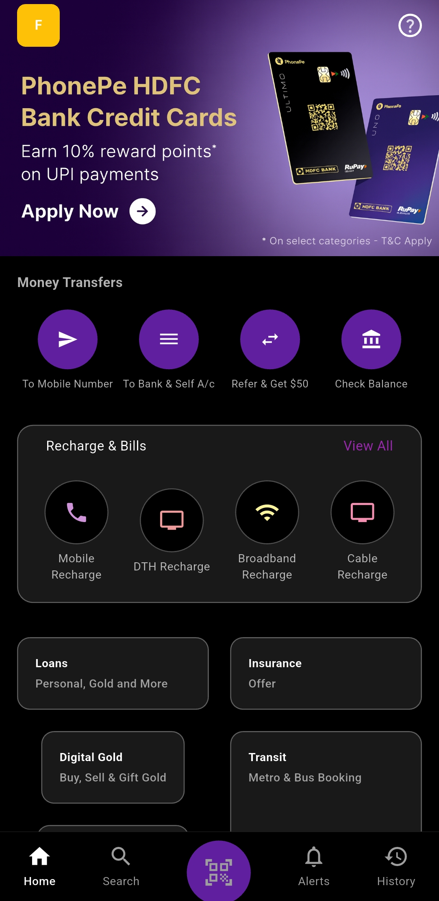
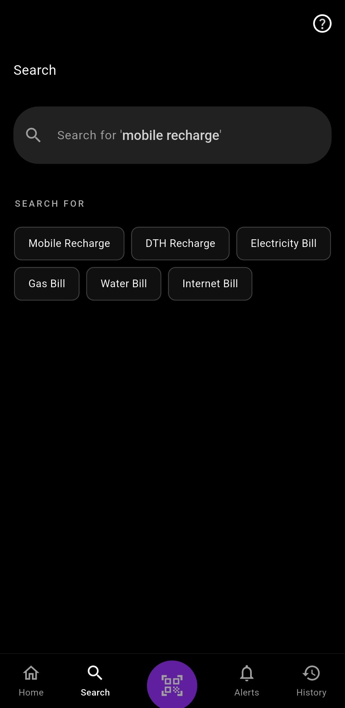
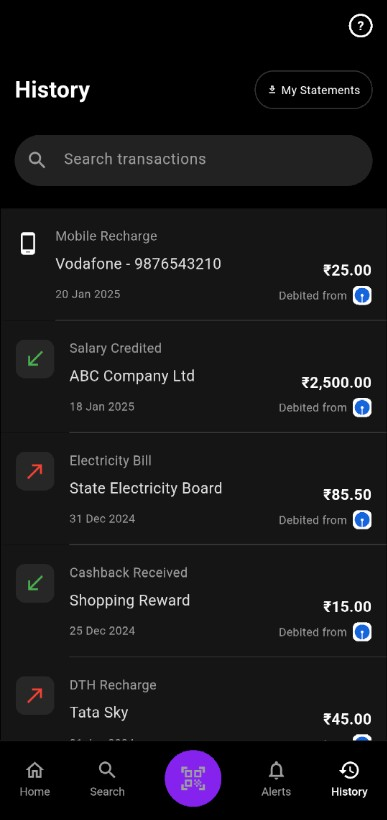
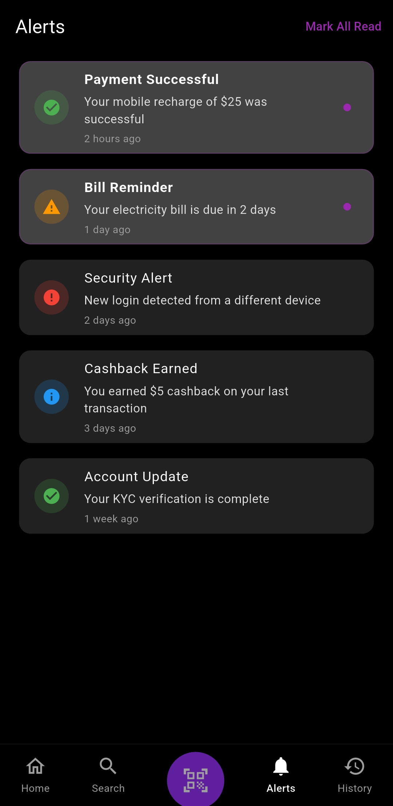
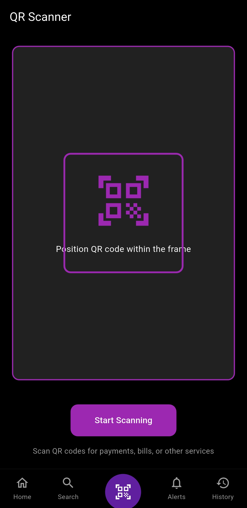

# Sliver App - Flutter Payment & Services App

A modern Flutter application featuring a sleek financial services interface with advanced UI components, smooth animations, and intuitive navigation.

> **Educational Project**: This application is created for learning purposes. The UI design and user experience are inspired by PhonePe's interface. This is a non-commercial educational project and no ownership is claimed over the original design concepts.

## 📱 Features

### 🏠 Home Screen

- **Custom Sliver AppBar** with image background and smooth scroll transitions
- **Sticky Header** that appears/disappears based on scroll position
- **Quick Actions Section** with circular action buttons for money transfers
- **Recharge & Bills Section** with colorful service icons
- **Payment Actions Grid** with various financial services
- **Slidable Container Widget** with pagination dots and smooth animations

### 🔍 Search Screen

- **Animated Hint Text** that cycles through different suggestions
- **Smart AppBar Transitions** - hides when keyboard appears
- **Interactive Suggestion Chips** with wrap layout
- **Dynamic Search Icon/Back Button** functionality
- **Smooth Focus Animations** with 800ms transitions

### 📜 History Screen

- **Collapsible Header** with scroll-based animations
- **Sticky Search Bar** that remains pinned while scrolling
- **Conditional Bottom Border** on search bar when scrolled
- **Transaction List** with color-coded icons (credit/debit)
- **Sliver-based Architecture** for smooth scrolling performance

### 🔔 Alerts Screen

- **Notification Management** with read/unread states
- **Color-coded Alert Types** (success, warning, error, info)
- **Mark All Read** functionality
- **Interactive List Items** with proper touch feedback

### 📷 QR Scanner Screen

- **Barcode Scanner Interface** with scanning animations
- **Circular Progress Indicator** during scan process
- **Result Dialog** with sample data display
- **Professional UI Design** with proper spacing and colors

### 🧭 Navigation

- **Custom Bottom Navigation Bar** with 5 tabs
- **Special QR Scanner Button** with purple circular highlight
- **Smooth Tab Switching** with proper state management
- **Icon State Management** (outlined/filled based on selection)

## 🎨 UI/UX Highlights

### Design System

- **Dark Theme** with black background throughout
- **Consistent Color Palette** with purple accents
- **Proper Typography** with letter spacing and font weights
- **Rounded Corners** and subtle borders for modern look

### Animations

- **Fade Transitions** for hint text cycling (800ms)
- **Slide Animations** for AppBar hiding/showing
- **Smooth Scrolling** with proper physics
- **Page Transitions** between navigation tabs

### Interactive Elements

- **Custom Chips** with borders and hover states
- **Animated Dots Indicator** for page navigation
- **Touch Feedback** on all interactive components
- **Keyboard-aware UI** adjustments

## 🏗️ Architecture

### Project Structure

```
lib/
├── main.dart                          # App entry point
├── main_app_wrapper.dart             # Navigation controller
├── screens/                          # All screen widgets
│   ├── home_screen.dart             # Main dashboard
│   ├── search_screen.dart           # Search with animations
│   ├── history_screen.dart          # Transaction history
│   ├── alerts_screen.dart           # Notifications
│   └── barcode_screen.dart          # QR scanner
└── widgets/                         # Reusable components
    ├── bottom_nav_bar.dart         # Custom navigation
    ├── slidable_container_widget.dart  # Paginated slider
    ├── quick_actions_section.dart   # Action buttons
    ├── recharge_bills_section.dart  # Service options
    ├── payment_actions_section.dart # Payment grid
    └── sticky_app_bar.dart         # Animated header
```

### Key Components

#### Custom Widgets

- **SlidableContainerWidget**: Paginated container with dots indicator
- **DotsIndicator**: Animated page position indicator
- **QuickActionItem**: Circular action buttons
- **BillActionItem**: Service-specific action items
- **PaymentActionCard**: Grid cards for payment services
- **StickyAppBar**: Scroll-aware app bar

#### Animation Controllers

- **Slide Animations**: For AppBar transitions
- **Fade Animations**: For hint text cycling
- **Opacity Animations**: For smooth UI state changes

## 🚀 Getting Started

### Prerequisites

- Flutter SDK (latest stable version)
- Dart SDK
- IDE (VS Code, Android Studio, etc.)

### Installation

1. **Clone the repository**

   ```bash
   git clone <repository-url>
   cd sliver_app
   ```

2. **Install dependencies**

   ```bash
   flutter pub get
   ```

3. **Add assets**

   - Add your image to `assets/test_image.png`
   - Update `pubspec.yaml` if needed

4. **Run the app**
   ```bash
   flutter run
   ```

## 📦 Dependencies

### Core Dependencies

```yaml
dependencies:
  flutter:
    sdk: flutter
  # Add any additional dependencies here
```

### Development Tools

```yaml
dev_dependencies:
  flutter_test:
    sdk: flutter
  flutter_lints: ^3.0.0
```

## 🎯 Key Technical Features

### Performance Optimizations

- **Sliver Widgets** for efficient scrolling
- **Proper Widget Disposal** to prevent memory leaks
- **Animation Controller Management** with lifecycle awareness
- **Conditional Rendering** to optimize build methods

### Responsive Design

- **Flexible Layouts** using Wrap and Flex widgets
- **Safe Area Handling** for different device sizes
- **Dynamic Spacing** based on content and screen size

### State Management

- **StatefulWidget** approach for local state
- **Animation State Tracking** for smooth transitions
- **Focus State Management** for keyboard interactions
- **Scroll Position Tracking** for UI adjustments

## 🔧 Customization

### Colors

Update colors in individual widget files or create a theme:

```dart
// Example color scheme
const primaryColor = Color(0xFF601f9e);
const backgroundColor = Colors.black;
const surfaceColor = Colors.grey.shade900;
```

### Animations

Modify animation durations and curves:

```dart
// Example animation customization
_animationController = AnimationController(
  duration: const Duration(milliseconds: 800), // Adjust timing
  vsync: this,
);
```

### Content

Update suggestion lists and service options in respective screen files.

## 📱 Screenshots

### Home Screen



### Search Screen




### History Screen




### Alerts Screen




### Scanner Screen




## 🤝 Contributing

1. Fork the repository
2. Create your feature branch (`git checkout -b feature/AmazingFeature`)
3. Commit your changes (`git commit -m 'Add some AmazingFeature'`)
4. Push to the branch (`git push origin feature/AmazingFeature`)
5. Open a Pull Request

## 👨‍💻 Developer Notes

### Code Organization

- **Separation of Concerns**: Each screen handles its own logic
- **Reusable Components**: Common widgets extracted to widgets folder
- **Clean Architecture**: Clear separation between UI and business logic

### Best Practices Implemented

- **Proper Widget Lifecycle Management**
- **Animation Controller Disposal**
- **Memory Leak Prevention**
- **Consistent Naming Conventions**
- **Code Documentation**

## 🐛 Known Issues

- None at the moment

## 🚧 Future Enhancements

- [ ] Add actual payment integration
- [ ] Implement real QR code scanning
- [ ] Add user authentication
- [ ] Integrate with backend services
- [ ] Add more animation effects
- [ ] Implement offline support

---

**Built with ❤️ using Flutter**
